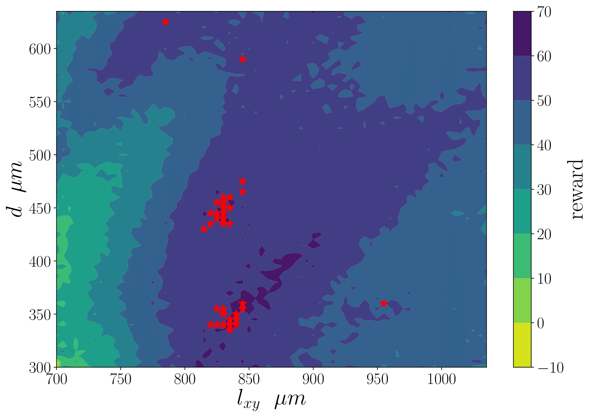

# ACC 2021
This repo contains the codes for the American Control Conference (2021) paper titled "A physics guided reinforcement learning framework for an autonomous manufacturing system with expensive data". 

     

